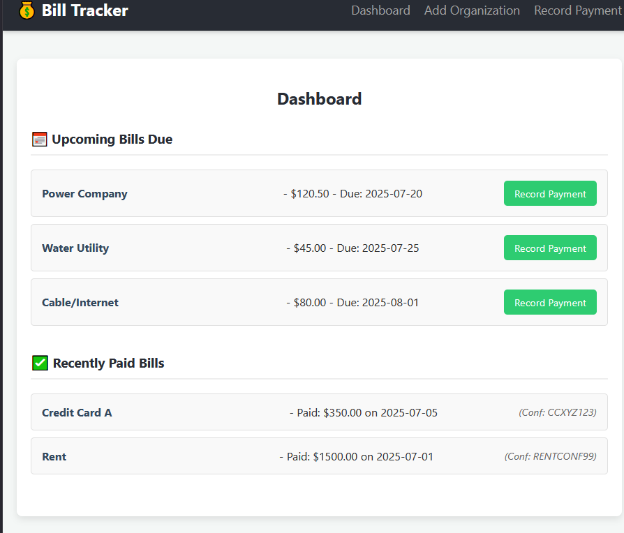

# BillTracker

## Design Goals

An app for tracking personal monthly bill payments such as power, water, and cable.

- Leverage [12 factor app](https://12factor.net) methodology
- Containerized [microservices](https://martinfowler.com/microservices/)
- [React](https://react.dev)front end
  - input web form for users to add, edit, delete, update of billing organization details
  - input web form for users to record monthly paid bill details
  - dashboard display of upcoming bills due
  - dashboard display of recently paid bills
- automated alerts
  - email notification including summary of upcoming bills due with link back to record paid details
- Mysql back end
  - records bill organization details and their payment entries
  - records user details and profile configuration
- API inter-service communication
  - get, list, edit, and add bill organization details
  - get and list upcoming bills due
  - add and delete paid bill details to include date paid, payment confirmation code, and amount paid

Test above with Google Gemini.

TODO: patch [docker-compose](my-bill-tracker/docker-compose.yaml) to include and run the db-init.sql to setup the myqsl db.

For more implementation details see the README.md in each directory starting with the [frontend microservice](my-bill-tracker-frontend/README.md).