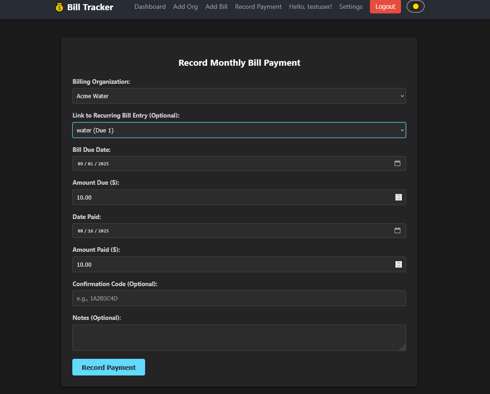

# Frontend React + Vite

This template provides a setup to get React working in Vite with HMR and some ESLint rules.

Currently, two official plugins are available:

- [@vitejs/plugin-react](https://github.com/vitejs/vite-plugin-react/blob/main/packages/plugin-react) uses [Babel](https://babeljs.io/) for Fast Refresh
- [@vitejs/plugin-react-swc](https://github.com/vitejs/vite-plugin-react/blob/main/packages/plugin-react-swc) uses [SWC](https://swc.rs/) for Fast Refresh

Backend Microservices Breakdown

1. User Service:
    - Manages user registration, login, and profile configurations.
    - Handles authentication and authorization.
2. Organization Service:
    - Manages billing organization details (e.g., company name, account number, typical due date).
    - Provides APIs for adding, editing, deleting, and listing organizations.
3. Bill Payment Service:
    - Manages individual monthly bill payment entries (e.g., amount due, due date, actual paid date, confirmation code).
    - Provides APIs for recording, updating, and deleting paid bill details.
    - Links payments to specific organizations and users.
4. Notification Service:
   - Handles automated email alerts.
   - Triggers notifications based on upcoming bill due dates.
   - Generates email content with summaries and links.
5. API Gateway
   - a reverse proxy
   - handles all frontend calls to backend services

## Data Flow and Communication

Microservices and monolithic service oriented architecture outline.

- Frontend (React App) communicates with the backend service REST APIs indirectly through the API Gateway service.
- Backend Services use the API Gateway to communicate with each other via internal API interservice communication (e.g., HTTP/REST or a message broker). For example, the Notification Service will query the Bill Payment Service to get upcoming bill details.
- MySQL Database will be the persistent storage for all services. Each service will ideally have its own dedicated database schema or database instance for true microservices isolation, though a shared database with separate tables is also an option for simplicity initially.

## Technical Stack

- Frontend: React.js (with a routing library like React Router and a state management library React Context API).
- Backend (Microservices): A robust framework like Node.js with Express, Python with Flask/Django REST Framework, or Java with Spring Boot. Each service can potentially use a different technology if needed, showcasing polyglot persistence and programming.
- Database: MySQL for relational data storage.
- Containerization: Docker for packaging each microservice and the React app.
- Orchestration: Docker Compose for local development, and Kubernetes for production deployment and scaling.
- API Gateway: For routing external requests to the correct microservice and handling cross-cutting concerns like authentication.
- Message Broker (FUTURE TODO): RabbitMQ or Kafka could be used by the Notification Service to process email queues asynchronously.

## Key Features and Implementation Details

React Frontend

The user interface will be intuitive and responsive.

    Authentication/Authorization: User login/registration handled by the User Service.

    Billing Organization Management:

        A dedicated web form for users to add new billing organizations, including fields for:

            Organization Name (e.g., "Dominion Energy", "Verizon Fios")

            Account Number

            Typical Due Day of Month

            Website/Contact Info

        Ability to edit and delete existing organization details.

        A list view of all configured organizations.

    Monthly Bill Recording:

        An input web form to record monthly paid bill details. This form would likely be linked from the organization details or a general "Record Payment" section.

        Fields would include:

            Associated Billing Organization (dropdown)

            Bill Due Date

            Amount Due

            Date Paid

            Payment Confirmation Code

            Amount Paid (actual amount paid, in case it differs from amount due)

        Ability to edit and delete recorded payments.

    Dashboard Displays:

        Upcoming Bills Due: A section displaying bills that are due soon, potentially highlighted by proximity to the due date. This will fetch data from the Bill Payment Service.

        Recently Paid Bills: A section showing the last N bills that have been marked as paid, including key details like organization, amount, and date paid.

## MySQL Backend

Each service will interact with the MySQL database to store and retrieve its specific data.

    User Service Schema:

        users table: id, username, password_hash, email, profile_config (e.g., notification preferences).

    Organization Service Schema:

        organizations table: id, user_id (foreign key), name, account_number, typical_due_day, website.

    Bill Payment Service Schema:

        bills table: id, organization_id (foreign key), user_id (foreign key), due_date, amount_due, is_paid, date_paid, payment_confirmation_code, amount_paid.

## API Inter-Service Communication

Each microservice will expose a RESTful API.

    Organization Service APIs:

        GET /organizations: List all organizations for a user.

        GET /organizations/{id}: Get details of a specific organization.

        POST /organizations: Add a new organization.

        PUT /organizations/{id}: Edit an existing organization.

        DELETE /organizations/{id}: Delete an organization.

    Bill Payment Service APIs:

        POST /bills: Add a new bill payment entry.

        PUT /bills/{id}: Update an existing bill payment (e.g., mark as paid).

        DELETE /bills/{id}: Delete a bill payment entry.

        GET /bills/upcoming: List upcoming bills due for a user.

        GET /bills/paid/recent: List recently paid bills for a user.

## Automated Alerts (Notification Service)

    A scheduled job within the Notification Service will periodically query the Bill Payment Service for upcoming bills.

    For identified upcoming bills, it will generate and send an email notification to the user associated with the bill.

    The email will include:

        A summary of the upcoming bills (organization, amount, due date).

        A direct link back to the React application, potentially pre-filling details or navigating to the "Record Payment" section for that bill.

## Development Workflow (Containerized)

    Individual Service Development: Each microservice can be developed and tested independently in its own container.

    Docker Compose for Local Dev: A docker-compose.yml file will orchestrate all services (frontend, all backend microservices, MySQL database) to run together in a local development environment.

    CI/CD: Set up a continuous integration/continuous deployment pipeline to automate testing, building Docker images, and deploying to a staging/production environment (e.g., Kubernetes cluster).


## Component Structure Overview

Organization of the frontend into several key components:

    src/App.jsx: The main application component, handling routing.

    src/components/Header.jsx: A simple navigation header.

    src/pages/Dashboard.jsx: Displays upcoming and recently paid bills.

    src/pages/BillOrganizationForm.jsx: Form for adding/editing bill organizations.

    src/pages/RecordPaymentForm.jsx: Form for recording monthly bill payments.

    src/pages/NotFound.jsx: For handling invalid routes.


## Integration of frontend with organization service

React frontend makes API calls to the Organization Service. This involves:

1. Updating BillOrganizationForm.jsx: To send POST requests for adding and PUT requests for updating. It will also make a GET request if editing an existing organization.

2. Updating Dashboard.jsx: To fetch and display the list of organizations. For now, we'll display the organizations as a list, and eventually, this data will be used to track specific bills associated with them.

3. Establishing API Base URL: A central place to configure the backend API endpoint.

### Details

1. Frontend Configuration

The `./src/config.js` configuration file manages the API endpoint.

2. BillOrganizationForm.jsx integration

This interacts with the Organization Service to add, update, and delete organizations.

The `./src/pages/Forms.css` provides a simple error message style.

3. List orgs

The `src/pages/Dashboard.jsx` fetches and display the organizations registered with the backend. It will simply list them. A separate Bill Payment Service tracks specific bills.

The `src/pages/Dashboard.css` file adds styles for new links and sections.

4. Organization ID

The `RecordPaymentForm.jsx` form primarily uses the organizationId passed from the dashboard to pre-select the organization, rather than relying solely on the name. It fetches the list of organizations from the backend to populate its dropdown.

The`preselected-info` block in src/pages/Forms.css is a simple style for preselected info.

## Running the Integrated Application

1. Backend

Example code To run the integrated application
```
docker compose up --build -d
```

2. Start frontend

```
cd my-bill-tracker-frontend
npm run dev
```

3. Browse to frontend

e.g., http://localhost:5173/

observe the following:

    Dashboard: Upon loading, the dashboard will attempt to fetch organizations from http://localhost:3001/organizations and display them. If you previously added dummy data in MySQL, you should see it here.

    Add Organization Form: When you use the "Add Organization" link and submit the form, the data will be sent to your Organization Service via a POST request. You should see a success alert, and after navigating back to the dashboard, the new organization should appear (you might need to refresh the page to see it, or implement state refresh in React, which is a next step).

    Edit Organization Form: Clicking "Edit" next to an organization will pre-fill the form by fetching that organization's details from the backend. Submitting the form sends a PUT request.

    Delete Organization: The delete button sends a DELETE request to the backend.

    Record Payment Form: The "Billing Organization" dropdown will now be populated with organizations fetched from your backend. The payment submission itself is still simulated, as we haven't built the Bill Payment Service yet.

## Integration of User Service with Frontend

Integrated User Service:

1. Authentication-related Pages/Components: forms for user registration and login.
2. App.jsx: routing for the new authentication pages.
3. Authentication Logic: Handle form submissions, send requests to the User Service, store the JWT token, and manage user state (logged in/out).
4. Protect Frontend Routes: certain parts of the application (like the dashboard and forms) are only accessible to authenticated users.
5. API Base URL: Add the User Service API URL to our config.js

configuration:

1. frontend config

User Service API base URL in my-bill-tracker-frontend/src/config.js.

2. auth client

User authentication state global management across the app uses the React Context in `my-bill-tracker-frontend/src/context/AuthContext.jsx`.

3. auth pages

- `my-bill-tracker-frontend/src/pages/Register.jsx` 
- `my-bill-tracker-frontend/src/pages/Login.jsx`

4. Header integration with auth pages

The header shows login/logout options based on authentication status with a style for the logout button and user info in `src/components/Header.css`

5. auth wrapped application

The application is wrapped with AuthProvider and implements protected routes using a ProtectedRoute component in `my-bill-tracker-frontend/src/App.jsx`. A simple loading style is located in `src/App.css`.

6. authentication api calls

- API Calls to use authAxios (Critical!).
- All API calls to protected backend services (like the Organization Service) must include the JWT token.
- `my-bill-tracker-frontend/src/pages/BillOrganizationForm.jsx` uses the authAxios function from AuthContext.

## Running frontend with user service

1. Ensure all backend services are running:

```
docker compose up --build -d
```

Confirm bill-tracker-mysql, bill-tracker-organization-service, and bill-tracker-user-service are all running.

2. Start React frontend:
Open a new terminal, navigate into your frontend directory:
Bash
```
cd my-bill-tracker-frontend
npm run dev
```
3. Open your browser to the frontend URL (e.g., http://localhost:5173/).

## Test Flow:

    Initial Load: You should be redirected to the /login page immediately because no user is authenticated.

    Register: Click "Register". Fill in a username, email, and password. Submit the form.

        If successful, you should be redirected to the Dashboard. Your username should appear in the header.

        If it fails (e.g., duplicate username/email), you'll see an error message.

    Logout: Click the "Logout" button in the header. You should be redirected back to the /login page.

    Login: Enter the credentials of the user you just registered. Submit the form.

        If successful, you'll be on the Dashboard, seeing your registered organizations (since user_id is still hardcoded to 1 in the organization service, which matches the first user registered).

    Test Protected Routes: Try to directly navigate to /add-organization or /record-payment without being logged in. You should be redirected to /login. Once logged in, you should be able to access them.

    Add/Edit/Delete Organizations: Now that you are logged in, try adding, editing, and deleting organizations. These actions should now correctly send the Authorization header to your Organization Service.

The above produces a fully authenticated frontend capable of registering and logging in users, and all interactions with the Organization Service are protected by JWT tokens.

A crucial next step was to update the Organization Service to use the actual user_id extracted from the JWT token instead of the hardcoded user_id = 1. 

1.  Updated Frontend Configuration

Added the Bill Payment Service API base URL to `my-bill-tracker-frontend/src/config.js`.

2.  Created my-bill-tracker-frontend/src/pages/AddBillForm.jsx

This form allows users to define recurring bill entries (e.g., "Electricity Bill" for "Dominion Energy" due on the 20th of each month).

An info-message style was added to the `src/pages/Forms.css`. 

3. Update my-bill-tracker-frontend/src/pages/RecordPaymentForm.jsx

This form saves payments to the Bill Payment Service. It will allow linking a payment to an existing recurring bill entry if selected.

4. Update my-bill-tracker-frontend/src/pages/Dashboard.jsx

The Dashboard fetches and display real upcoming and recently paid bills from your Bill Payment Service.

Add new styles for dashboard sections to src/pages/Dashboard.css. 

5. Updated my-bill-tracker-frontend/src/App.jsx

Added the route for the new AddBillForm

Added styles for dashboard sections to src/pages/Dashboard.css. 

6.  Updated my-bill-tracker-frontend/src/components/Header.jsx

Added a link to the new "Add Bill" form.

## Running the Integrated Frontend

Ensure all backend services are running:
- From your project root (where docker-compose.yml is), run:
```
docker compose up --build -d
```
Confirm bill-tracker-mysql, bill-tracker-organization-service, and bill-tracker-bill-payment-service are all running and healthy.

Start the React frontend:
Open a new terminal, navigate into your frontend directory:
Bash

    cd my-bill-tracker-frontend
    npm run dev

    Open your browser to the frontend URL (e.g., http://localhost:5173/).

Test Flow:

    Login/Register: If not already logged in, register a new user or log in with an existing one.

    Add Organization: Go to "Add Org" and add a new organization (e.g., "Electricity Company").

    Add Bill Entry: Go to "Add Bill".

        Select the organization you just created.

        Enter a "Bill Name" (e.g., "Monthly Electricity").

        Provide a "Typical Due Day" and "Typical Amount".

        Submit the form.

    Record Payment: Go to "Record Payment".

        Select the organization.

        You should now see the "Link to Recurring Bill Entry" dropdown populated with "Monthly Electricity". Select it.

        Fill in Due Date, Amount Due, Date Paid, Amount Paid, and Confirmation Code.

        Submit the form.

    Dashboard View: Navigate back to the Dashboard.

        You should now see the organization listed.

        More importantly, the "Upcoming Bills Due" and "Recently Paid Bills" sections should now display the payment you just recorded (it will appear in "Recently Paid Bills" because you marked it as paid with a datePaid).

        Try adding another bill and recording a payment for a future due date, and you should see it appear in "Upcoming Bills Due".

The above provides a fully integrated frontend interacting with the Bill Payment Service, allowing users to track their recurring bills and individual payments. This significantly enhances the functionality of the application!

The existing services were additionally refined tp provide the following.
- More features (like bill reminders & editing recurring bills/payments from the frontend). 
- Deploying the application.

Continue reading for additional details on the refinement. 

## Slack Testing

1. Log in to your application.
2. Navigate to http://localhost:8080/settings.
3. Enable "Enable Slack Notifications" and enter a valid Slack Webhook URL.
4. Click the "Validate" button next to the Slack Webhook URL field.
5. Check your Slack channel for the test message. You should see "BillTracker test message from [Your Username]..."
6. SAlso, observe the success/error messages displayed on the User Profile page.

## Local Development / Contributing

Here is the order to follow when building and testing individual services during local development.

1. [backend api-gateway (Node.js and Express)](../backend/api-gateway/README.md)
2. [backend db](../backend/db/README.md)
3. [backend user-service](../backend/user-service/README.md)
   
4. [backend organization-service](../backend/organization-service/README.md)
   
5. [backend bill-payment-service](../backend/bill-payment-service/README.md)
   
   
   
6. [frontend](../my-bill-tracker-frontend/README.md) (this page)

Or go back to the [main README](../README.md). 